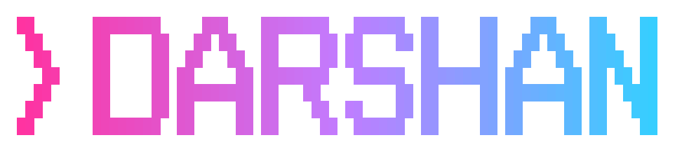
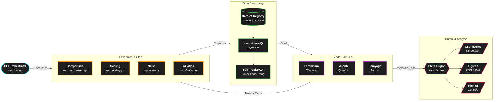
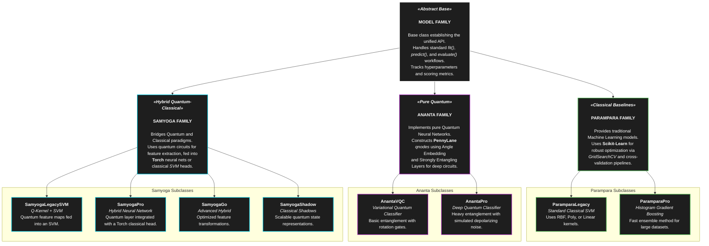
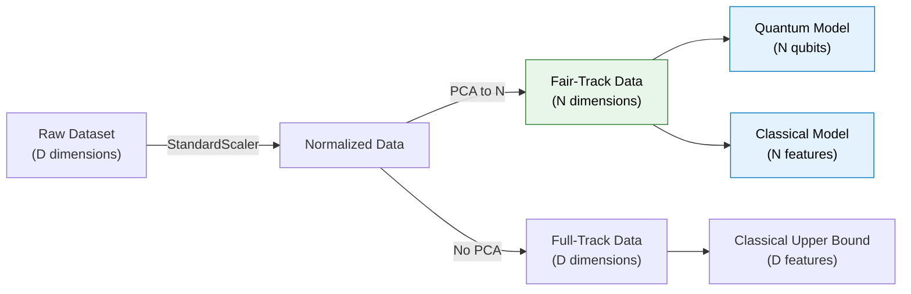

# DARSHAN: Hybrid Quantum-Classical Machine Learning Framework

<p align="center">
  
</p>

<p align="center">
  
  
  
  
  
</p>

<p align="center">
  <strong>Full-fledged hybrid quantum-classical machine learning framework featuring interactive CLI orchestration, classical/quantum/hybrid model training, dataset preprocessing, fair-track benchmarking, statistical evaluation, and visualization pipelines.</strong>
</p>

<p align="center">
  <strong>Made by Aakar Gupta</strong>
</p>

---

## Repository Metadata

<div align="center">

| Field | Value |
|---|---|
| Repository name | `darshan-qml` |
| Made by | Aakar Gupta |
| Project type | Interactive Terminal Framework / Hybrid QML Workbench |
| Primary domain | Quantum Machine Learning (QML) |
| Secondary domain | Classical/Quantum Model Training, Benchmarking, and Visualization |
| Core technologies | Python, PennyLane, scikit-learn, SciPy, Rich UI, Matplotlib, Seaborn |
| Data policy | Synthetic and public benchmark datasets (Iris, Wine, Breast Cancer). No sensitive data. |

</div>

<div style="border-left: 6px solid #2e7d32; background: #edf7ed; padding: 12px 16px; margin: 16px 0;">
<strong>Project Highlight:</strong> Benchmarking classical, quantum, and hybrid quantum-classical models under fair dimensional parity with automated experiment tracking, significance testing, and publication-ready visual outputs.
</div>

---

## Table of Contents

<div align="center">

| # | Concept & Architecture | # | Operations & Reference |
|---|---|---|---|
| 1 | [Executive Summary](#1-executive-summary) | 13 | [Repository Structure](#13-repository-structure) |
| 2 | [Problem Statement & Motivation](#2-problem-statement--motivation) | 14 | [Installation & Environment Setup](#14-installation--environment-setup) |
| 3 | [Feature Overview](#3-feature-overview) | 15 | [Quick Start](#15-quick-start) |
| 4 | [Architecture](#4-architecture) | 16 | [Model Taxonomy](#16-model-taxonomy) |
| 5 | [Layer Responsibilities](#5-layer-responsibilities) | 17 | [Dataset Catalog](#17-dataset-catalog) |
| 6 | [Fair-Track Methodology](#6-fair-track-methodology) | 18 | [CLI Command Reference](#18-cli-command-reference) |
| 7 | [Training & Evaluation Workflow](#7-training--evaluation-workflow) | 19 | [UI, Themes & Visualization](#19-ui-themes--visualization) |
| 8 | [Experiment Suites](#8-experiment-suites) | 20 | [Metrics Reference](#20-metrics-reference) |
| 9 | [Results & Artifacts](#9-results--artifacts) | 21 | [Reproducing Benchmark Results](#21-reproducing-benchmark-results) |
| 10 | [Known Limitations](#10-known-limitations) | 22 | [Troubleshooting](#22-troubleshooting) |
| 11 | [Future Work](#11-future-work) | 23 | [Documentation Hub](#23-documentation-hub) |
| 12 | [Citation & Research Usage](#12-citation--research-usage) |  |  |

</div>

---

## 1. Executive Summary

*In Sanskrit, Darshan denotes vision and direct perception of truth — fitting for a framework built to rigorously evaluate quantum advantage claims.*

The Darshan framework provides a structured environment to evaluate whether quantum models (like Variational Quantum Classifiers) genuinely outperform classical models (like SVMs), or if observed "quantum advantage" is merely an artifact of unfair feature representations. 

By enforcing dimensional parity (reducing classical input dimensions to match the quantum qubit count via PCA), injecting realistic noise, and scaling sample sizes, Darshan reveals the true boundary of quantum utility in the NISQ (Noisy Intermediate-Scale Quantum) era. The framework operates via an interactive, richly themed terminal REPL, abstracting away the boilerplate of data loading, cross-validation, plotting, and statistical reporting.

---

## 2. Problem Statement & Motivation

A pervasive flaw in Quantum Machine Learning (QML) literature is comparing a classical SVM operating on 30 raw features against a VQC running on 4 qubits. When the classical model wins, the conclusion "classical algorithms surpass quantum" is structurally invalid due to the massive information bandwidth disparity ($D{=}30$ vs $N{=}4$).

Darshan systematically addresses three core research questions:

1. **Unfair QML Comparisons & Dimensional Parity:** Does quantum advantage survive when classical baselines are restricted to the *same* dimensionality as the quantum circuit via PCA? Darshan uses the **Fair-Track Methodology** to enforce this.
2. **NISQ Noise Degradation:** How do hybrid quantum-classical architectures degrade under realistic depolarizing noise ($p \in [0, 0.20]$)?
3. **Sample Efficiency in Low-Data Regimes:** Given limited data ($N < 200$ samples), do quantum kernel features provide superior generalization compared to classical kernels?

---

## 3. Feature Overview

<div align="center">

| Capability | Details |
|---|---|
| **Models** | 9 variants across 3 families: Parampara (classical), Ananta (pure quantum), Samyoga (hybrid) |
| **Datasets** | 7 datasets spanning synthetic (moons) to empirical (iris, wine, breast_cancer, digits, pendigits) |
| **Experiments** | Multi-seed comparison, scaling, noise degradation, component ablation, quantum advantage |
| **Fair-Track** | Automated PCA-based dimensional parity for classical baselines |
| **Statistics** | Mean/std aggregation, Welch's t-test, Wilcoxon signed-rank, Cohen's d effect size |
| **Visualization** | Matplotlib PNG/SVG charts, Rich terminal bar charts, Plotext terminal curves |
| **UI** | 7 color themes, gradient text, tab-completion, interactive `questionary` menus |
| **Persistence** | Timestamped CSV logs, `.npz` model checkpoints, `history.json` tracking |

</div>

---

## 4. Architecture

### High-Level Framework Architecture



### Model Families


## 5. Layer Responsibilities

<div align="center">

| Layer | Files | Purpose |
|---|---|---|
| **Data Layer** | `data/loader.py` | Dataset loading, preprocessing (StandardScaler → PCA → MinMaxScaler), stratified subsampling |
| **Model Layer** | `models/*.py` | Model architectures, `fit()`, `predict()`, `evaluate()`, hyperparameter grids |
| **Experiment Layer** | `experiments/*.py` | Multi-seed orchestration, noise injection, scaling loops, statistical reporting |
| **UI Layer** | `ui/*.py` | Console styling, theme grids, Rich tables, Matplotlib chart rendering |
| **Utils Layer** | `utils/logger.py` | Background log capture (`WorkingLog`) to keep the CLI clean |
| **CLI Orchestrator** | `darshan.py` | The main interactive REPL state machine routing commands to layers |

</div>

---

## 6. Fair-Track Methodology

The Fair-Track Methodology ensures that classical and quantum models compete on a leveled informational playing field.



- **Dimensional Parity:** If the quantum circuit uses 4 qubits, classical baselines are PCA-restricted to exactly 4 features.
- **Fair vs. Industry:** Parampara Pro has two modes. `fair` uses PCA constraints. `industry` operates on all raw features to represent the absolute classical upper bound.
- **Why?** It prevents false positives where classical models "win" purely because they have access to larger feature vectors that current quantum simulators cannot process.

---

## 7. Training & Evaluation Workflow


---

## 8. Experiment Suites

All experiments are launched via `/test [suite]` from the CLI.

<div align="center">

| Suite | CLI Command | Description |
|---|---|---|
| **Compare** | `/test compare` | Multi-seed benchmark of all models on the currently loaded dataset. |
| **Sweep** | `/test sweep` | Loops the comparison suite across multiple selected datasets. |
| **Scaling** | `/test scaling` | Accuracy vs training sample size ($N \in \{10, 20, 50, 100, 200\}$). |
| **Noise** | `/test noise` | Accuracy vs depolarizing noise ($p \in \{0.0, 0.01, 0.05, 0.1, 0.2\}$). |
| **Ablation** | `/test ablation` | Component removal study for Hybrid models to prove quantum utility. |
| **Stats** | `/test stats` | Generates statistical report + LaTeX tables from existing metric CSVs. |
| **Q-Advantage** | `/test quantum_advantage` | Analyzes Hilbert space theoretical scaling vs classical data scaling. |

</div>

---

## 9. Results & Artifacts

Darshan automatically generates organized artifacts during experiments.

### Metrics & Raw Data (`results/metrics/`)
<div align="center">

| File Pattern | Description |
|---|---|
| `model_comparison.csv` | Master aggregated comparison results |
| `scaling_analysis.csv` | Tabular data for sample size curves |
| `noise_analysis.csv` | Tabular data for noise degradation curves |
| `*_table.tex` | Exported LaTeX tables ready for research papers |

</div>

### Generated Figures (`results/figures/`)
<div align="center">

| File Pattern | Description |
|---|---|
| `comparison_*.png` | Metric comparison bar charts |
| `n_scaling_*.png` | Learning curves across varying sample sizes |
| `noise_study_*.png` | Accuracy drop-off relative to depolarizing probability |
| `confusion_matrix_*.png` | Post-benchmark heatmaps |

</div>

---

## 10. Known Limitations

<div align="center">

| Limitation | Impact |
|---|---|
| **Simulation Only** | PennyLane uses `default.qubit`. No physical hardware backend is currently implemented. |
| **Qubit Ceiling** | State vector simulation scales exponentially. Circuits beyond 12 qubits become impractical on CPU. |
| **Circuit Bottleneck** | `QuantizedSelfAttention` in Samyoga Pro is $O(N^2)$ in quantum evaluations, making it extremely slow. |
| **Noise Models** | Only depolarizing noise is currently supported (amplitude/phase damping are theoretical in guides). |
| **No GPU Acceleration** | Native PyTorch GPU offloading is not implemented; operations rely on CPU NumPy/PennyLane. |

</div>

---

## 11. Future Work

- **Real Quantum Hardware:** Integration with IBM Qiskit or Amazon Braket.
- **Extended Noise Models:** Amplitude damping, phase flip, and T1/T2 decoherence.
- **Quantum Error Mitigation:** Implement Zero-Noise Extrapolation (ZNE) and Probabilistic Error Cancellation (PEC).
- **Expanded Datasets:** Fashion-MNIST and basic molecular property prediction datasets.
- **Automated Hyperparameter Optimization:** Bayesian optimization for VQC circuit depths and learning rates.
- **Web Dashboard:** Exporting CLI reports to an interactive Streamlit or Gradio frontend.

---

## 12. Citation & Research Usage

If you use this framework or its methodology in your research, please cite:

```text
Gupta, A. (2026). Darshan: A Hybrid Quantum-Classical Machine Learning Framework
for Rigorous Benchmarking under Dimensional Parity Constraints.
```

---

## 13. Repository Structure

```text
Darshan/
├── darshan.py                    # Main CLI orchestrator and REPL
├── requirements.txt              # Dependency pinning
├── start_darshan.bat             # Windows UTF-8 launcher script
├── data/
│   └── loader.py                 # Dataset registry and preprocessing
├── models/
│   ├── parampara_*.py            # Classical SVM / baselines
│   ├── ananta_*.py               # Pure VQC / quantum extractors
│   └── samyoga_*.py              # Hybrid Quantum-Classical networks
├── experiments/
│   ├── run_*.py                  # Experiment orchestration scripts
│   └── stats_engine.py           # Significance testing and LaTeX export
├── ui/
│   ├── components.py             # Rich console UI elements
│   ├── graphs.py                 # Matplotlib figure generation
│   └── theme.py                  # CLI color themes
├── results/
│   ├── history.json              # Append-only experiment run log
│   ├── metrics/                  # CSV logs and LaTeX tables
│   └── figures/                  # Generated PNG/SVG charts
└── docs/
    └── Guides/                   # Detailed architectural markdown documentation
```

---

## 14. Installation & Environment Setup

### Prerequisites
- Python 3.10+
- `pip`

### Setup Steps
```powershell
# 1. Clone the repository
git clone <repository_url>
cd Darshan

# 2. Create a virtual environment
python -m venv .venv
.\.venv\Scripts\Activate

# 3. Install dependencies
pip install -r requirements.txt
```

---

## 15. Quick Start

Launch the interactive terminal framework:

On Windows, the recommended launch method is the bundled batch script because it sets UTF-8 environment variables and activates `.venv` or `venv` if available.

```powershell
.\start_darshan.bat
```

Direct fallback:

```powershell
python darshan.py
```

### Example Session Flow
```text
 ❯ /dataset wine               # 1. Load a dataset
 ❯ /model samyoga_pro          # 2. Inspect an architecture
 ❯ /test compare               # 3. Run multi-seed benchmarks
 ❯ /results                    # 4. View winner podiums
 ❯ /report                     # 5. Export findings to markdown
```

---

## 16. Model Taxonomy

<div align="center">

| Family | Model ID | Type | Core Concept | Role |
|---|---|---|---|---|
| **Parampara** | `parampara_legacy` | Classical | RBF/Poly/Linear SVM | Minimal classical floor |
| **Parampara** | `parampara` (fair) | Classical | Tuned SVM via RandomizedSearchCV | PCA-bounded classical champion |
| **Ananta** | `ananta` | Quantum | Variational Quantum Classifier | Pure quantum baseline |
| **Ananta** | `ananta_pro` | Hybrid | Quantum Feature Extractor + SVM | Quantum feature utility test |
| **Samyoga** | `samyoga_legacy` | Hybrid | VQC Pre-training + Ensemble Head | Production-oriented NISQ model |
| **Samyoga** | `samyoga_pro` | Hybrid | Quantized Self-Attention + SSM | Theoretical exploration |
| **Samyoga** | `samyoga_go` | Mock Hybrid | NumPy vectorized quantum mock | Fast prototyping baseline |
| **Samyoga** | `samyoga_shadow`| Classical Twin| Parameter-matched MLP | Fair-Track parameter baseline |

</div>

---

## 17. Dataset Catalog

<div align="center">

| Dataset | Raw Features | Target (PCA) | Classes | Preprocessing Flow |
|---|---|---|---|---|
| **moons** | 2 | None | 2 | `StandardScaler → MinMaxScaler` |
| **iris** | 4 | None | 3 | `StandardScaler → MinMaxScaler` |
| **wine** | 13 | 4 | 3 | `StandardScaler → PCA(4) → MinMaxScaler` |
| **breast_cancer** | 30 | 8 | 2 | `StandardScaler → PCA(8) → MinMaxScaler` |
| **complexity_wall**| 16 | 4 | 2 | `StandardScaler → PCA(4) → MinMaxScaler` |
| **digits** | 64 | 4 | 10 | `StandardScaler → PCA(4) → MinMaxScaler` |
| **pendigits** | 16 | 4 | 10 | `StandardScaler → PCA(4) → MinMaxScaler` |

</div>

---

## 18. CLI Command Reference

### Core Operations
<div align="center">

| Command | Action |
|---|---|
| `/dataset [name]` | Load and format a dataset |
| `/model [name]` | Inspect architecture or run CV on a specific model |
| `/test [suite]` | Launch experiments (`compare`, `sweep`, `noise`, `scaling`) |
| `/epochs [N]` | Override VQC training epoch count |

</div>

### Result & Interface Commands
<div align="center">

| Command | Action |
|---|---|
| `/results` | Browse historical benchmark sessions and podiums |
| `/report` | Generate markdown research report |
| `/theme [name]` | Switch UI color scheme (e.g., `cyberpunk`, `forest`) |
| `/quiet [on\|off]`| Toggle progress bars for cleaner logs |
| `/reset` | Factory reset: deletes caches, metrics, and figures |

</div>

---

## 19. UI, Themes & Visualization

Darshan is built heavily on the `Rich` Python library, featuring interactive `questionary` prompts, gradient text, and ASCII-styled tables.

- **Theme Engine:** Select from curated palettes like `cyberpunk`, `quantum`, `solar`, and `forest`.
- **In-Terminal Graphs:** Immediate ASCII bar charts and line curves plotted using `plotext`.
- **Publication Exports:** All experiments generate 300 DPI Matplotlib PNGs in `results/figures/`.

---

## 20. Metrics Reference

The framework automatically calculates and logs:

<div align="center">

| Metric | Purpose |
|---|---|
| **Accuracy** | Baseline success rate across cross-validation splits |
| **F1 Macro** | Class-imbalance aware evaluation |
| **ROC AUC** | Classifier decision boundary confidence |
| **Train Time (s)** | Computational overhead (critical for quantum circuits) |
| **Prediction Time (s)** | Inference speed benchmarking |
| **P-Value** | Welch's t-test score indicating statistical significance over baselines |

</div>

---

## 21. Reproducing Benchmark Results

To completely recreate a clean run of the standard benchmark:

1. Launch `darshan.py`.
2. Run `/reset` to clear any local cache and metric files.
3. Run `/test sweep` and select the target datasets (e.g., `iris`, `wine`).
4. Select the `research` profile (10 epochs, 200 samples, 8 qubits).
5. Wait for execution (Samyoga models may take considerable time).
6. Run `/test stats` to generate final CSVs and LaTeX tables.
7. Open `results/figures/` to view the generated charts.

---

## 22. Troubleshooting

<div align="center">

| Symptom | Cause | Solution |
|---|---|---|
| `ModuleNotFoundError: pennylane` | Dependencies missing | Run `pip install -r requirements.txt` |
| SamyogaPro takes >30 mins | Circuit scaling bottleneck | Switch to `samyoga_go` or use `/test` profile `smoke` |
| Ugly ASCII characters on Windows | Encoding mismatch | Launch via `.\start_darshan.bat` to force UTF-8 |
| PCA reduces accuracy dramatically | High intrinsic dimension | Compare against `parampara_pro_industry` (no PCA) |

</div>

---

## 23. Documentation Hub

Refer to the deep-dive architectural docs in `docs/Guides/`:

- [Parampara Architecture](docs/Guides/parampara_architecture.md)
- [Ananta Architecture](docs/Guides/ananta_architecture.md)
- [Samyoga Architecture](docs/Guides/samyoga_architecture.md)
- [Fair-Track Methodology](docs/Guides/fair_track_methodology.md)
- [Experiments & Benchmarking](docs/Guides/experiments_guide.md)
- [CLI Reference & Commands](docs/Guides/cli_and_commands.md)
- [UI Styling & Visualization](docs/Guides/ui_and_themes.md)
- [Datasets & Preprocessing](docs/Guides/datasets_and_preprocessing.md)
- [Executive Summary Report](docs/Guides/summary_report.md)


