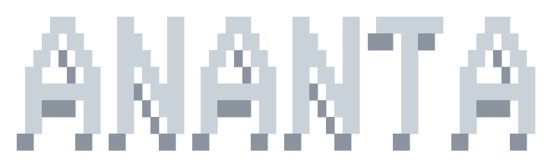

# Ananta Architecture Guide

<p align="center">
  
</p>

The **Ananta** family implements pure and hybrid quantum classifiers using PennyLane variational quantum circuits. These models test whether quantum Hilbert space mappings provide classification advantages over classical methods.

> *In Sanskrit, Ananta means "infinite" or "boundless" — reflecting the exponentially large Hilbert space that quantum circuits operate in.*

---

## 1. Model Variants

| Variant | Class | Source | Architecture |
|:---|:---|:---|:---|
| **Ananta VQC (Legacy)** | `AnantaVQC` | `models/ananta_vqc.py` | Pure variational quantum classifier with trainable readout |
| **Ananta Pro** | `AnantaPro` | `models/ananta_pro.py` | Quantum feature extractor (multi-seed) + classical SVM head |

---

## 2. Ananta VQC (`AnantaVQC`)

### Circuit Architecture

```
                    ┌─── Layer 1 ───┐  ┌─── Layer 2 ───┐      ┌─── Layer L ───┐
                    │               │  │               │      │               │
|0⟩ ─── Ry(x₀) ───┤ SEL[0]        ├──┤ SEL[0]        ├──...─┤ SEL[0]        ├──── ⟨X₀⟩,⟨Y₀⟩,⟨Z₀⟩
|0⟩ ─── Ry(x₁) ───┤ SEL[1]        ├──┤ SEL[1]        ├──...─┤ SEL[1]        ├──── ⟨X₁⟩,⟨Y₁⟩,⟨Z₁⟩
...                 │               │  │               │      │               │
|0⟩ ─── Ry(xₙ) ───┤ SEL[n]        ├──┤ SEL[n]        ├──...─┤ SEL[n]        ├──── ⟨Xₙ⟩,⟨Yₙ⟩,⟨Zₙ⟩
                    │  + Noise?     │  │  + Noise?     │      │  + Noise?     │
                    └───────────────┘  └───────────────┘      └───────────────┘
```

Where:
- **Ry(xᵢ):** AngleEmbedding using `qml.RY` rotation gates
- **SEL:** `qml.StronglyEntanglingLayers` — parameterized rotation + CNOT entangling gates
- **Noise:** Optional `qml.DepolarizingChannel(p)` on each qubit (activated when `noise_prob > 0`)
- **Measurements:** Expectation values of PauliX, PauliY, PauliZ on each qubit → 3×n_qubits outputs

### Data Re-Uploading

When `data_reuploading=True`, feature data is re-embedded before each variational layer. This increases the circuit's expressibility by allowing the quantum state to interact with input data at multiple circuit depths.

### Training

**Optimization loop:**
1. For each epoch, shuffle training data
2. For each mini-batch:
   - Compute cost via `_cost()` (cross-entropy or contrastive loss)
   - Update parameters via PennyLane optimizer
3. Track loss history, training accuracy
4. Early stopping with `patience=10` (if accuracy stagnates)

**Supported Optimizers:**

| Optimizer | PennyLane Class | Description |
|:---|:---|:---|
| `adam` (default) | `qml.AdamOptimizer` | Adaptive learning rate (recommended) |
| `gd` | `qml.GradientDescentOptimizer` | Standard gradient descent |
| `spsa` | `qml.SPSAOptimizer` | Simultaneous perturbation (noise-resilient) |

### Constructor Parameters

| Parameter | Type | Default | Description |
|:---|:---|:---|:---|
| `n_qubits` | int | `4` | Number of qubits (= number of input features) |
| `n_layers` | int | `3` | Number of variational layers |
| `learning_rate` | float | `0.05` | Optimizer step size |
| `epochs` | int | `30` | Maximum training epochs |
| `batch_size` | int | `32` | Mini-batch size |
| `noise_prob` | float | `0.0` | Depolarizing noise probability (0 = noiseless) |
| `data_reuploading` | bool | `False` | Re-embed data before each layer |
| `optimizer` | str | `'adam'` | Optimizer: `adam`, `gd`, `spsa` |
| `patience` | int | `10` | Early stopping patience (epochs without improvement) |
| `warm_start` | bool | `False` | Resume training from existing weights |
| `callbacks` | list | `[]` | UI callback handlers for progress reporting |

### Noise Simulation

When `noise_prob > 0`:
- Device switches from `default.qubit` to `default.mixed` (density matrix simulation)
- After each variational layer, `qml.DepolarizingChannel(noise_prob)` is applied to every qubit
- This simulates NISQ hardware decoherence

### Loss Function

**Binary classification:**
```
L_CE = -mean( y·log(σ(logit)) + (1-y)·log(1-σ(logit)) )
```

**Multiclass classification:**
```
L_CE = -mean( Σ_c y_c · log(softmax(logits)_c) )
```

Where `logits = Q_out · W_readout + b_readout` (linear readout from quantum expectations).

### Checkpointing

```python
model.save_checkpoint('results/ananta_checkpoint.npz')
model.load_checkpoint('results/ananta_checkpoint.npz')
```

Saves: weights, readout weights, readout bias, classes, epoch count, loss/accuracy history, training sessions count.

### Progressive Training

```python
model.continue_training(X, y, additional_epochs=10)
```

Resumes training from the current weight state, tracking cumulative epochs and session count.

### Evaluate Output

```python
{
    'model': 'Ananta',
    'accuracy': float,
    'f1_macro': float,
    'auc_roc': float,
    'brier_score': float,
    'log_loss': float,
    'train_time': float,
    'predict_time': float,
    'loss_history': list[float],
    'total_epochs': int,
    'training_sessions': int,
    'best_epoch': int
}
```

---

## 3. Ananta Pro (`AnantaPro`)

### Pipeline Architecture

```
X_train → PCA(n_qubits) → AnantaQuantumFeatures → [Concat with PCA features] → SelectKBest → SVC → RandomizedSearchCV
```

### Two-Stage Design

**Stage 1: Quantum Feature Extraction (`AnantaQuantumFeatures`)**

For each quantum seed (default: 3 seeds with values 11, 23, 37):
1. Initialize a quantum circuit with random weights
2. For each input sample, evaluate the circuit
3. Collect expectation values: `⟨PauliX⟩`, `⟨PauliY⟩`, `⟨PauliZ⟩` per qubit
4. This produces `n_seeds × 3 × n_qubits` quantum features per sample

**Stage 2: Classical Head (`RandomizedSearchCV`)**

1. Concatenate quantum features with original PCA features
2. Optionally compute polynomial interaction features (pairwise products)
3. Feature selection via `SelectKBest(mutual_info_classif, k=...)`
4. Train SVC with `RandomizedSearchCV`

### Ablation Modes

| Mode | `ablation_mode` | Behavior |
|:---|:---|:---|
| Full Hybrid | `None` | Both classical PCA and quantum features |
| Classical Only | `'classical_only'` | Only PCA features (quantum features zeroed out) |
| Quantum Only | `'quantum_only'` | Only quantum features (PCA features zeroed out) |
| Shuffled Quantum | `'shuffled_quantum'` | Quantum features randomly shuffled per-sample (destroys signal) |

These modes are used in ablation experiments to measure the contribution of each component.

### Constructor Parameters

| Parameter | Type | Default | Description |
|:---|:---|:---|:---|
| `n_qubits` | int | `4` | Number of qubits and PCA dimensions |
| `n_layers` | int | `3` | Variational circuit depth |
| `noise_prob` | float | `0.0` | Depolarizing noise probability |
| `noise_aware` | bool | `False` | Whether to activate noise channels |
| `quantum_feature_seeds` | tuple | `(42,)` | Random seeds for weight initialization (multi-seed = ensemble) |
| `head_search` | str | `'fast'` | Search intensity: `fast` (20 iter), `research` (100 iter) |
| `use_interactions` | bool | `True` | Whether to compute polynomial interaction features |
| `ablation_mode` | str\|None | `None` | Ablation variant (see table above) |
| `callbacks` | list | `[]` | UI callback handlers |

### Feature Space Mathematics

For `n_qubits=4` and 3 quantum seeds:
- **PCA features:** 4 dimensions
- **Quantum features per seed:** 3 observables × 4 qubits = 12
- **Total quantum features:** 3 seeds × 12 = 36
- **Combined features:** 4 (PCA) + 36 (quantum) = 40
- **With interactions:** 40 + C(40, 2) = 40 + 780 = 820 features

`SelectKBest` then reduces this to the most informative features.

### Noise-Aware Mode

When `noise_aware=True` and `noise_prob > 0`:
- Quantum circuits use `default.mixed` device
- `DepolarizingChannel(noise_prob)` applied per qubit after each layer
- Tests whether quantum features remain useful under NISQ conditions

### Evaluate Output

```python
{
    'model': 'AnantaPro (Hybrid Ensemble)',
    'accuracy': float,
    'f1_macro': float,
    'auc_roc': float,
    'brier_score': float,
    'log_loss': float,
    'train_time': float,
    'predict_time': float,
    'best_params': dict,
    'classification_report': dict,
    'quantum_transform_time': float
}
```

---

## 4. Quantum Circuit Details

### StronglyEntanglingLayers

PennyLane's `StronglyEntanglingLayers` implements:
- 3 rotation gates (Rot(φ, θ, ω)) per qubit per layer
- CNOT entangling gates between pairs of qubits
- Entanglement pattern varies per layer (imprimitive entanglement)

Weight shape: `(n_layers, n_qubits, 3)` — 3 rotation parameters per qubit per layer.

### Observables

All models measure three Pauli observables per qubit:

| Observable | Matrix | Physical Interpretation |
|:---|:---|:---|
| `⟨PauliX⟩` | $\begin{pmatrix} 0 & 1 \\ 1 & 0 \end{pmatrix}$ | Coherence between |0⟩ and |1⟩ |
| `⟨PauliY⟩` | $\begin{pmatrix} 0 & -i \\ i & 0 \end{pmatrix}$ | Phase coherence |
| `⟨PauliZ⟩` | $\begin{pmatrix} 1 & 0 \\ 0 & -1 \end{pmatrix}$ | Population difference |

This provides a maximally informative characterization of each qubit's quantum state.

---

## 5. Known Limitations

1. **Barren Plateaus:** At n_qubits > 8, StronglyEntanglingLayers circuits exhibit gradient vanishing (barren plateau problem), making optimization extremely difficult.
2. **Training Time:** Each quantum circuit evaluation requires full state vector simulation (exponential in n_qubits). Training time scales as O(epochs × samples × 2^n_qubits).
3. **No Hardware Execution:** All circuits run on PennyLane's software simulators. Real QPU results would include additional noise sources not captured by DepolarizingChannel alone.
4. **Fixed Architecture:** The circuit ansatz (StronglyEntanglingLayers) is fixed. Alternative ansätze (e.g., hardware-efficient, problem-inspired) are not currently supported.

---

## 6. Usage Examples

### Single-model benchmark

```
 ❯ /dataset iris
 ❯ /model ananta            # Ananta VQC (Legacy)
 ❯ /model ananta_pro        # Ananta Pro (Hybrid)
```

### Progressive training

```
 ❯ /model ananta             # Initial training (30 epochs)
 ❯ /train continue ananta 20 # Continue for 20 more epochs
 ❯ /checkpoint save ananta   # Save weights
```

### Noise study

```
 ❯ /test noise               # Compare all models across noise levels
```
