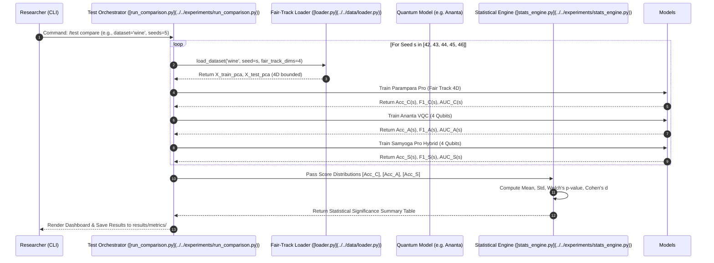

# The Fair-Track Methodology: Rigorous Empirical Parity in Quantum Machine Learning

A pervasive flaw in contemporary Quantum Machine Learning (QML) literature is the execution of unconstrained benchmarking experiments. In standard academic studies, researchers frequently evaluate a classical Support Vector Machine (SVM) or Random Forest operating on all available dataset features (e.g., 30 features in the Wisconsin Breast Cancer dataset) against a Variational Quantum Classifier (VQC) running on a 4-qubit quantum processor or simulator.

When the classical baseline outperforms the quantum circuit in such an experiment, the conclusion that "classical algorithms surpass quantum algorithms" is methodologically invalid. The classical model was granted access to a significantly larger information bandwidth ($D=30$) compared to the quantum model's restricted dimensionality ($N=4$).

The **Darshan Framework** eliminates this experimental artifact through its proprietary **Fair-Track Methodology**.

---

## 1. The Core Principles of Fair-Track Parity

The Fair-Track protocol enforces strict environmental and dimensional equality across all competing architectures:

1. **Dimensional Parity**: If the target quantum circuit possesses $N$ qubits, all classical baseline models must be evaluated on an identical $N$-dimensional representation of the input dataset.
2. **Information Bottlenecking via PCA**: To compress a $D$-dimensional dataset into $N$ dimensions without arbitrary feature dropping, Darshan applies orthogonal Principal Component Analysis (PCA), retaining the top $N$ components of maximum variance.
3. **Hyperparameter Optimization Equality**: Classical baselines under Fair-Track (such as `Parampara Pro`) are not handicapped by default parameter choices; they undergo exhaustive grid search optimization over kernel spaces, regularization penalties ($C$), and kernel coefficients ($\gamma$) within that bounded $N$-dimensional space.

```mermaid
flowchart TD
    subgraph Raw Dataset Space
        Raw["Raw Dataset X_train, X_test\n(D Dimensions, e.g., D=30)"] --> Norm["StandardScaler\nZ-Score Normalization"]
    end

    subgraph The Fair-Track Bottleneck Engine ([loader.py](../../data/loader.py))
        Norm --> Check{"Execution Track\nSelected?"}
        Check -->|Full Track| ClassicalFull["Parampara Legacy (Full)\nEvaluates on all D=30 features\n(Serves as Classical Upper Bound)"]
        
        Check -->|Fair Track| PCA["PCA Orthogonal Projection\nExtract Top N Principal Components\n(N = Qubit Count, e.g., N=4)"]
        PCA --> X_pca["Bounded Parity Dataset\nX_train_pca, X_test_pca in R^N"]
    end

    subgraph Model Execution Parity
        X_pca --> Q_Branch["Quantum Models (Ananta / Samyoga)\n4 Qubits -> Angle Embedding"]
        X_pca --> C_Branch["Classical Champion (Parampara Pro)\n4D Grid Search Optimization"]
    end

    Q_Branch --> Eval["Empirical Comparison & Statistical Engine\nWelch's t-test, Cohen's d, Wilcoxon Signed-Rank"]
    C_Branch --> Eval
```

---

## 2. Mathematical Formulation of the PCA Bottleneck

Let the centered and scaled training matrix be $\mathbf{X} \in \mathbb{R}^{M \times D}$, where $M$ is the sample count and $D$ is the initial feature dimension. The empirical sample covariance matrix $\mathbf{\Sigma} \in \mathbb{R}^{D \times D}$ is computed as:

$$\mathbf{\Sigma} = \frac{1}{M - 1} \mathbf{X}^T \mathbf{X}$$

By performing eigendecomposition or Singular Value Decomposition (SVD) on $\mathbf{\Sigma}$, we obtain eigenvalues $\lambda_1 \ge \lambda_2 \ge \dots \ge \lambda_D \ge 0$ and corresponding orthonormal eigenvectors $\mathbf{v}_1, \mathbf{v}_2, \dots, \mathbf{v}_D$.

To construct the Fair-Track dataset for an $N$-qubit quantum model ($N < D$), we form the projection matrix $\mathbf{W}_N \in \mathbb{R}^{D \times N}$ using the top $N$ eigenvectors:

$$\mathbf{W}_N = \left[ \mathbf{v}_1 \; \mathbf{v}_2 \; \dots \; \mathbf{v}_N \right]$$

The Fair-Track training and testing feature sets are generated via linear projection:

$$\mathbf{X}_{\text{Fair}} = \mathbf{X} \mathbf{W}_N \in \mathbb{R}^{M \times N}$$

The proportion of total variance explained ($\text{PVE}$) by this $N$-dimensional bottleneck is monitored by the framework:

$$\text{PVE}(N) = \frac{\sum_{i=1}^N \lambda_i}{\sum_{j=1}^D \lambda_j}$$

> [!NOTE]
> If $\text{PVE}(N)$ is low (e.g., $< 0.60$), the dataset possesses high intrinsic dimensionality. If a quantum model (Ananta/Samyoga) outperforms Parampara Pro under low PVE conditions, it proves that the quantum Hilbert space mapping is superior at isolating non-linear class manifolds from highly compressed, overlapping principal components.

---

## 3. The Statistical Evaluation Engine (`statistics.py`)

A single experimental run is insufficient to claim quantum superiority due to random seed variations in train/test splitting, quantum parameter initialization, and noise realizations. Darshan enforces rigorous multi-seed evaluation ($K \ge 5$ seeds) evaluated through a dedicated statistical engine.

When comparing a Quantum Champion model ($Q$) against the Fair-Track Classical Champion ($C$) across $K$ independent random seeds, Darshan evaluates three critical statistical metrics:

### 3.1 Welch's t-test for Unequal Variances
Tests the null hypothesis $H_0: \mu_Q = \mu_C$ without assuming equal variance between quantum and classical score distributions:

$$t = \frac{\overline{X}_Q - \overline{X}_C}{\sqrt{\frac{s_Q^2}{N_Q} + \frac{s_C^2}{N_C}}}, \quad \nu \approx \frac{\left( \frac{s_Q^2}{N_Q} + \frac{s_C^2}{N_C} \right)^2}{\frac{(s_Q^2 / N_Q)^2}{N_Q - 1} + \frac{(s_C^2 / N_C)^2}{N_C - 1}}$$

Where $\overline{X}$, $s^2$, and $N$ denote sample mean, sample variance, and seed count, respectively. A p-value $p < 0.05$ rejects the null hypothesis, establishing statistically significant superiority.

### 3.2 Cohen's d Effect Size
Quantifies the standardized difference between model performance distributions, independent of sample size:

$$d = \frac{\overline{X}_Q - \overline{X}_C}{s_{\text{pooled}}}, \quad s_{\text{pooled}} = \sqrt{\frac{(N_Q - 1)s_Q^2 + (N_C - 1)s_C^2}{N_Q + N_C - 2}}$$

| Cohen's d Value | Statistical Interpretation | Practical QML Meaning |
| :--- | :--- | :--- |
| $|d| < 0.2$ | Negligible Effect | Performance is practically identical; no quantum utility. |
| $0.2 \le |d| < 0.5$ | Small Effect | Minor empirical variation, likely sensitive to hyperparameter tuning. |
| $0.5 \le |d| < 0.8$ | Medium Effect | Consistent separation between quantum and classical decision boundaries. |
| $|d| \ge 0.8$ | **Large / Dramatic Effect** | **Definitive Quantum Advantage** under Fair-Track parity constraints. |

### 3.3 Wilcoxon Signed-Rank Test
A non-parametric paired difference test evaluating whether the median difference between paired seed runs is significantly non-zero:

$$W = \sum_{i=1}^K \left[ \text{sgn}(X_{Q,i} - X_{C,i}) \cdot R_i \right]$$

Where $R_i$ represents the rank of absolute differences $|X_{Q,i} - X_{C,i}|$. This test guarantees robustness against outlier seeds where training convergence might have stalled.

---

## 4. Empirical Evaluation Protocol

The sequence diagram below illustrates the exact validation protocol executed when a researcher triggers `/test compare` or `/test quantum_advantage`:



---

## 5. Summary: Why Fair-Track Matters for Research Integrity

By adhering strictly to the Fair-Track methodology, Darshan ensures that:
1. Every claim of Quantum Advantage is backed by exact dimensional parity.
2. Classical baselines are given their strongest possible theoretical defense via automated GridSearchCV.
3. All empirical conclusions are statistically validated across multiple random realizations rather than anecdotal single-run highlights.
