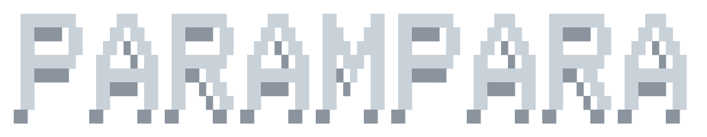

# Parampara Architecture Guide

<p align="center">
  
</p>

The **Parampara** family represents the classical baseline models in the Darshan framework. These are aggressively tuned Support Vector Machines and gradient-boosting classifiers that establish the performance ceiling that quantum models must exceed to demonstrate advantage.

> *In Sanskrit, Parampara means "tradition" or "succession" — representing the classical ML lineage against which quantum innovations are measured.*

---

## 1. Model Variants

| Variant | Class | Source | Key Feature |
|:---|:---|:---|:---|
| **Parampara Legacy** | `ParamparaLegacy` | `models/parampara_svm.py` | GridSearchCV SVM with optional PCA, Nystroem for large datasets |
| **Parampara Pro (Fair)** | `ParamparaPro(mode='fair')` | `models/parampara_pro.py` | RandomizedSearchCV SVM with mandatory PCA to `n_qubits` dimensions |
| **Parampara Pro+ (Industry)** | `ParamparaPro(mode='industry')` | `models/parampara_pro.py` | RandomizedSearchCV with optional HistGBM for N>10k, full feature access |

---

## 2. Parampara Legacy (`ParamparaLegacy`)

### Pipeline Architecture

```
X_train → StandardScaler → [PCA if n_pca set] → SVC(probability=True) → GridSearchCV/RandomizedSearchCV → Fitted Model
```

### Constructor Parameters

| Parameter | Type | Default | Description |
|:---|:---|:---|:---|
| `tuning_mode` | str | `'fast'` | Hyperparameter search intensity: `fast`, `research`, `full`, `large` |
| `n_pca` | int\|None | `None` | Number of PCA components (None = no PCA) |
| `cv_folds` | int | `5` | Cross-validation fold count |
| `random_state` | int | `42` | Random seed for reproducibility |

### Tuning Modes

| Mode | Classifier | Search Method | Parameter Grid |
|:---|:---|:---|:---|
| `fast` | SVC(RBF) | GridSearchCV | C: [1, 10], γ: [scale, 0.1] |
| `research` | SVC(RBF/Poly/Sigmoid) | GridSearchCV + Calibration | C: [0.1, 1, 10, 100], γ: [scale, auto, 0.01, 0.1, 1], kernels: [rbf, poly, sigmoid], class_weight: [None, balanced] |
| `full` | SVC(RBF/Poly/Sigmoid/Linear) | RandomizedSearchCV + Calibration | C: logspace(-2, 3, 6), γ: [scale, auto] + logspace(-3, 1, 5), degree: [2, 3] |
| `large` | SGDClassifier(log_loss) | RandomizedSearchCV | Via Nystroem kernel approximation (n_components: [50, 100], γ: [scale, 0.1, 1]) |

### Calibration

In `research`, `full`, and `large` modes, the best estimator is wrapped in `CalibratedClassifierCV(method='sigmoid', cv='prefit')` for improved probability estimates.

### Evaluate Output

```python
{
    'model': 'ParamparaLegacy',
    'accuracy': float,           # Test accuracy
    'f1_macro': float,           # Macro F1
    'auc_roc': float,            # AUC-ROC (OvR macro for multiclass)
    'brier_score': float,        # Brier score (binary only, NaN otherwise)
    'log_loss': float,           # Log loss
    'train_time': float,         # Training wall-clock time (seconds)
    'predict_time': float,       # Prediction wall-clock time (seconds)
    'best_params': dict,         # Best hyperparameters from GridSearchCV
    'best_cv_score': float,      # Best cross-validation accuracy
    'calibrated': bool,          # Whether calibration was applied
    'classification_report': dict # Per-class precision/recall/f1
}
```

---

## 3. Parampara Pro (`ParamparaPro`)

### Pipeline Architecture

```
Fair Mode:   X_train → StandardScaler → PCA(n_qubits) → SVC(RBF) → RandomizedSearchCV → Fitted Model
Industry:    X_train → StandardScaler → SVC(RBF) or HistGBM → RandomizedSearchCV → Fitted Model
```

### Constructor Parameters

| Parameter | Type | Default | Description |
|:---|:---|:---|:---|
| `mode` | str | `'fair'` | `fair` (PCA-bounded) or `industry` (full features) |
| `n_qubits` | int | `4` | PCA target dimensionality (used only in fair mode) |
| `tuning_mode` | str | `'fast'` | `fast`, `research`, or `champion` |

### Execution Modes

**Fair Mode (`mode='fair'`):**
- Applies `PCA(n_components=n_qubits)` to enforce dimensional parity with quantum circuits
- Always uses SVC(RBF) as the classifier
- This is the mode used in all Fair-Track benchmarks

**Industry Mode (`mode='industry'`):**
- No PCA — uses all available features
- For datasets with N>10,000 samples, automatically switches to `HistGradientBoostingClassifier`
- Serves as the classical upper bound (unfair advantage over quantum models)

### Tuning Modes

| Mode | n_iter | Cross-Validation | Purpose |
|:---|:---|:---|:---|
| `fast` | 30 | StratifiedKFold(5) | Quick iteration |
| `research` | 100 | RepeatedStratifiedKFold(5, 2) | Publication-quality |
| `champion` | 500 | RepeatedStratifiedKFold(5, 5) | Maximum optimization |

### Parameter Distributions

**SVC (Fair or Industry with N ≤ 10k):**
- `C`: `loguniform(0.001, 1000.0)` — log-uniform regularization sweep
- `gamma`: `loguniform(0.0001, 100.0)` — log-uniform kernel coefficient sweep
- `class_weight`: `[None, 'balanced']` — handle class imbalance

**HistGBM (Industry with N > 10k):**
- `learning_rate`: `loguniform(0.001, 1.0)`
- `max_iter`: `[100, 200, 500, 1000]`
- `max_leaf_nodes`: `[15, 31, 63, 127]`
- `l2_regularization`: `loguniform(1e-6, 10.0)`
- `min_samples_leaf`: `[1, 5, 10, 20, 50]`

### Evaluate Output

```python
{
    'model': 'ParamparaPro (Fair Track)' or 'ParamparaPro (Industry Track)',
    'accuracy': float,
    'f1_macro': float,
    'auc_roc': float,
    'brier_score': float,
    'log_loss': float,
    'train_time': float,
    'predict_time': float,
    'best_params': dict
}
```

---

## 4. Usage in the CLI

```
# Run a specific model via CLI
 ❯ /model parampara              # Fair-Track Pro
 ❯ /model parampara_legacy       # Legacy baseline
 ❯ /model parampara_pro_industry # Industry upper bound
```

In comparison experiments, all three variants are automatically included:
- **Parampara Legacy** — Minimal tuning strawman
- **Parampara Pro** — Fair-Track bounded champion
- **Parampara Pro+** — Unbounded industry champion

---

## 5. Benchmarking Role

The Parampara family fulfills two critical roles:

1. **Fair-Track Barrier:** Parampara Pro (Fair) operates under the same dimensional constraints as quantum models. Any quantum model that fails to beat Parampara Pro (Fair) has failed to demonstrate quantum advantage.

2. **Classical Upper Bound:** Parampara Pro+ (Industry) represents what classical ML can achieve with unrestricted feature access. The gap between Parampara Pro+ and quantum models reveals the cost of PCA compression.

### Expected Performance Ranges (Inferred from Results)

| Dataset | Parampara Legacy | Parampara Pro (Fair) | Parampara Pro+ (Industry) |
|:---|:---|:---|:---|
| Iris | 100.0% | 93.3% | 93.3% |
| Wine | 97.2% | 94.4% | 94.4% |
| Breast Cancer | ~95% | ~90% | ~95% |
