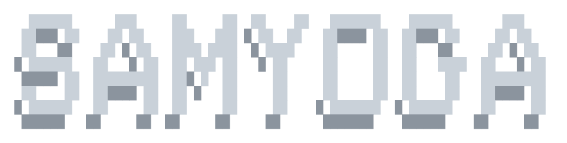
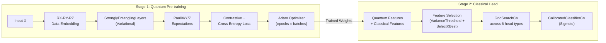
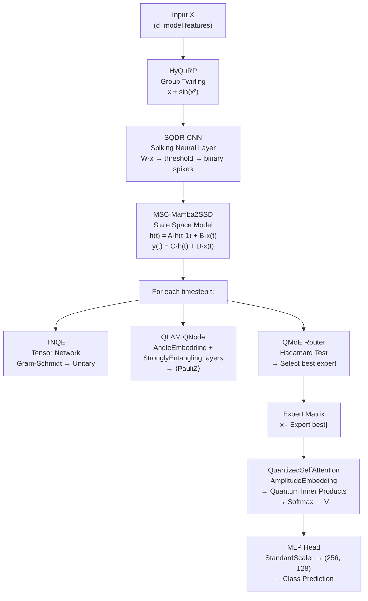

# Samyoga Architecture Guide

<p align="center">
  
</p>

The **Samyoga** family implements the most architecturally complex models in Darshan. These are hybrid quantum-classical architectures that use quantum circuits for feature extraction and classical neural networks or SVMs as trainable classification heads.

> *In Sanskrit, Samyoga means "union" or "conjunction" — representing the synthesis of quantum and classical computing paradigms.*

---

## 1. Model Variants

| Variant | Class | Source | Architecture | Quantum Backend | Training Speed |
|:---|:---|:---|:---|:---|:---|
| **Samyoga Legacy** | `SamyogaLegacySVM` | `models/samyoga_svm.py` | VQC pre-training → quantum feature extraction → ensemble head selection | PennyLane | Slow |
| **Samyoga Pro** | `SamyogaPro` | `models/samyoga_pro.py` | TNQE + SQDR-CNN + Mamba-2 SSM + QMoE + MLP head | PennyLane (full circuits) | Very Slow |
| **Samyoga Go** | `SamyogaGo` | `models/samyoga_go.py` | Same architecture as Pro, NumPy-mocked circuits | NumPy (no PennyLane) | Very Fast |
| **Samyoga Shadow** | `SamyogaShadow` | `models/samyoga_shadow.py` | Parameter-matched MLP classical twin | None (pure classical) | Very Fast |

---

## 2. Samyoga Legacy (`SamyogaLegacySVM`)

### Two-Stage Pipeline



### Stage 1: VQC Pre-training

**Circuit:**
```
|0⟩ ─── RX(x₀) ─ RY(x₀) ─ RZ(x₀) ─── StronglyEntanglingLayers ─── [Noise?] ─── ⟨X⟩,⟨Y⟩,⟨Z⟩
```

- Uses `RX`, `RY`, `RZ` rotation gates per qubit (data re-uploading at each layer)
- `StronglyEntanglingLayers` applied per variational layer
- Optional `DepolarizingChannel(noise_prob)` per qubit
- Measurements: PauliX, PauliY, PauliZ on each qubit → 3×n_qubits quantum outputs
- Optimized via `qml.AdamOptimizer` with batch training

**Contrastive Loss (optional, `use_contrastive_loss=True`):**
```
L_total = L_CE + 0.1 × (intra_class_variance / inter_class_variance)
```
- Computes centroids per class in quantum feature space
- Encourages intra-class compactness and inter-class separation

### Stage 2: Classical Head Selection

After VQC pre-training, quantum features are extracted and concatenated with original features:

**Feature construction:**
1. For each quantum seed, extract PauliX/Y/Z expectations → reshape to `(n_samples, 3 × n_qubits)`
2. Concatenate all seed outputs: `(n_samples, n_seeds × 3 × n_qubits)`
3. Optionally compute pairwise polynomial interactions: `q_i × q_j` for all pairs
4. Concatenate with original features: `(n_samples, original_dim + quantum_dim + interaction_dim)`

**Feature selection:**
1. `VarianceThreshold(threshold=1e-5)` — remove near-constant features
2. `SelectKBest(mutual_info_classif, k=...)` — keep top-k by mutual information

**Head candidates (in `full`/`research` tuning modes):**

| Head | Classifier | Grid Parameters |
|:---|:---|:---|
| SVM | `SVC(probability=True)` | C: [0.1, 1, 10], γ: [scale, 0.1], kernel: [rbf, linear] |
| LR | `LogisticRegression` | C: [0.1, 1, 10] |
| RF | `RandomForestClassifier` | n_estimators: [50, 100], max_depth: [None, 5, 10] |
| GB | `GradientBoostingClassifier` | n_estimators: [50], learning_rate: [0.1, 0.05] |
| ET | `ExtraTreesClassifier` | n_estimators: [50, 100] |
| Nystroem+SGD | `Nystroem → SGDClassifier` | γ: [0.1, 0.2, 0.5], α: [0.0001, 0.001, 0.01] |

In `fast` mode, only SVM is evaluated for speed.

### Feature Caching

Quantum feature extraction is computationally expensive. Samyoga Legacy implements SHA-256 hash-based caching:

```python
# Cache key includes: dataset name, n_qubits, n_layers, epochs, random_state, noise_prob, interactions flag, input data bytes, weight bytes
cache_path = f"results/cache/cache_samyoga_legacy_{dataset}_{prefix}_{hash[:16]}.npy"
```

Cached features are loaded automatically on subsequent runs with identical configuration.

### Constructor Parameters

| Parameter | Type | Default | Description |
|:---|:---|:---|:---|
| `n_qubits` | int | — | Number of qubits (must match input features) |
| `n_layers` | int | `3` | Variational circuit depth |
| `learning_rate` | float | `0.05` | Adam optimizer step size |
| `epochs_pretrain` | int | `15` | VQC pre-training epochs |
| `batch_size` | int | `32` | Mini-batch size |
| `noise_prob` | float | `0.0` | Depolarizing noise probability |
| `cv_folds` | int | `5` | CV folds for head selection |
| `random_state` | int | `42` | Random seed |
| `max_train_samples` | int\|None | `None` | Cap on pre-training samples |
| `dataset_name` | str | `'unknown'` | Used in cache key generation |
| `use_interactions` | bool | `True` | Compute polynomial interactions |
| `feature_selection` | bool | `True` | Apply VarianceThreshold + SelectKBest |
| `calibration` | bool | `True` | Wrap head in CalibratedClassifierCV |
| `tuning_mode` | str | `'fast'` | Head search intensity |
| `warm_start` | bool | `False` | Resume from existing weights |
| `n_quantum_seeds` | int | `1` | Number of independent weight initializations |
| `use_contrastive_loss` | bool | `True` | Enable contrastive loss term |
| `use_pca_hybrid` | bool | `False` | Apply PCA on combined features |

### Checkpointing

```python
model.save_checkpoint('results/samyoga_checkpoint.npz')
model.load_checkpoint('results/samyoga_checkpoint.npz')
```

Saves: weights (all seeds), readout weights, readout biases, classes, epoch count, loss/accuracy/val history, session count.

---

## 3. Samyoga Pro (`SamyogaPro`)

### Sub-Module Architecture

Samyoga Pro is an enterprise-grade pipeline combining 7 advanced modules:



### Sub-Modules

| Module | Class | Description | Quantum? |
|:---|:---|:---|:---|
| **TNQE** | `TNQE` | Tensor Network Quantum Encoding — constructs block unitaries via Gram-Schmidt orthogonalization | Simulated (NumPy) |
| **SQDR-CNN** | `SQDR_CNN` | Spiking-Quantum Data Re-upload CNN — applies binary threshold activation to linear projections | No (classical) |
| **HyQuRP** | `HyQuRP` | Hybrid Quantum-Classical with Rotational/Permutational Equivariance — applies group twirling transform `x + sin(x²)` | No (mathematical) |
| **MSC-Mamba2SSD** | `MSC_Mamba2SSD` | Mamba-2 State Space Model with multi-modal connector — sequential processing with state matrix A, input/output projections B, C, D | No (classical SSM) |
| **QLAM** | PennyLane QNode | Quantum Latent Attention Module — `AngleEmbedding → StronglyEntanglingLayers → ⟨PauliZ⟩` per qubit | **Yes (PennyLane)** |
| **QuantizedSelfAttention** | `QuantizedSelfAttention` | Quantum inner product attention — uses `AmplitudeEmbedding` + adjoint for pairwise state overlaps | **Yes (PennyLane)** |
| **QMoE** | `QMoERouter` | Quantum Mixture-of-Experts router — selects expert via generalized quantum Hadamard test | Partially (dot product proxy) |
| **NGQS-AdaInit** | `NGQS_AdaInit` | Neural-Network Generated Quantum States — initializes expert matrices via neural network | No (classical initialization) |

### Error Mitigation

**Distance-Scaled Zero-Noise Extrapolation (DS-ZNE):**
```python
def distance_scaled_zne(self, func, distances, *args):
    # Evaluate function at multiple noise distances
    # Fit polynomial and extrapolate to zero-noise limit
    results = [func(*args) + noise(1/d) for d in distances]
    poly = np.polyfit([1/d for d in distances], results, deg=len(distances)-1)
    return poly[-1]  # Zero-noise extrapolated value
```

**Federated Edge Update:**
```python
def federated_edge_update(self, gradient_update):
    self.experts[0] -= 0.01 * gradient_update
```
Simulates distributed gradient updates for edge deployment scenarios.

### Why It's Slow

The `QuantizedSelfAttention.compute_attention()` method executes $O(n^2)$ PennyLane circuit calls:
```python
for i in range(seq_len):
    for j in range(seq_len):
        probs = self.qnode(Q[i], K[j])  # Full quantum circuit evaluation
```

For a dataset with 100 samples and 16 features, this means ~10,000 circuit evaluations per forward pass.

---

## 4. Samyoga Go (`SamyogaGo`)

### Differences from Samyoga Pro

Samyoga Go has the **identical class structure** as Samyoga Pro but replaces all PennyLane quantum circuits with NumPy equivalents:

| Component | SamyogaPro Implementation | SamyogaGo Implementation |
|:---|:---|:---|
| QLAM | `qml.QNode: AngleEmbedding → StronglyEntanglingLayers → ⟨Z⟩` | `np.sin(inputs * weights)` |
| QuantizedSelfAttention | `qml.QNode: AmplitudeEmbedding → adjoint → probs[0]` | `np.abs(Q_norm @ K_norm.T)**2 → softmax` |
| QMoE Router | Uses QNode device | Uses `np.dot` (same mathematical proxy) |

### Purpose

SamyogaGo serves as a **speed-optimized classical mock** of SamyogaPro:
- If SamyogaGo achieves similar accuracy to SamyogaPro, the PennyLane quantum overhead provides no measurable benefit
- If SamyogaPro significantly outperforms SamyogaGo, the quantum circuits add genuine value

### Training Time Comparison (Inferred from Results)

| Model | Wine (3 seeds) | Iris (3 seeds) |
|:---|:---|:---|
| SamyogaPro | 120–1600 seconds | 80–90 seconds |
| SamyogaGo | 0.1–0.2 seconds | 0.1–0.3 seconds |

---

## 5. Samyoga Shadow (`SamyogaShadow`)

### Purpose

A **parameter-matched classical MLP** that controls for the hypothesis: "Samyoga Pro is better simply because it has more parameters, not because of quantum effects."

### Architecture

```python
MLPClassifier(
    hidden_layer_sizes=(h1, h2, h3),
    activation='relu', solver='adam',
    learning_rate_init=0.002, max_iter=1000
)
```

Where layer sizes are computed to match Samyoga Pro's parameter footprint:

| Layer | Size Formula | Default (d_model=16, d_state=8, num_experts=3) |
|:---|:---|:---|
| h1 | `max(128, d_model × 16)` | 256 |
| h2 | `max(64, d_model × 8 × num_experts)` | 384 |
| h3 | `d_state × 8` | 64 |

### Interpretation

- **SamyogaPro > SamyogaShadow:** Quantum structure provides genuine advantage beyond parameter count
- **SamyogaPro ≈ SamyogaShadow:** No quantum advantage — the parameter budget alone explains performance
- **SamyogaShadow > SamyogaPro:** Classical architecture is more efficient for this task

### When Used

Samyoga Shadow is only included in comparison experiments when **Fair Mode** is enabled:
```python
if fair_mode:
    models['Samyoga Shadow'] = SamyogaShadow(...)
```

---

## 6. Callback System

All Samyoga models support a callback interface for UI progress reporting:

```python
class MyCallback:
    def on_stage_start(self, stage_name, total_steps=None):
        print(f"Starting: {stage_name}")
    
    def on_stage_end(self, stage_name):
        print(f"Completed: {stage_name}")
    
    def on_batch_end(self, batch_index, total_batches):
        print(f"Batch {batch_index}/{total_batches}")
    
    def on_epoch_end(self, epoch, loss, model_name, total_epochs):
        print(f"Epoch {epoch}/{total_epochs}, Loss: {loss:.4f}")
```

The Darshan CLI passes Rich progress bar callbacks to display real-time training progress.

### Samyoga Legacy Stages

1. `'Quantum Feature Pre-training'` — VQC epoch training loop
2. `'Extracting Quantum Features'` — Feature extraction per batch
3. `'Hybrid Head Training'` — Head selection via GridSearchCV

### Samyoga Pro/Go Stages

1. `'Hybrid Feature Extraction'` — Full forward pass through all sub-modules
2. `'Training Classification Head'` — MLP head fitting

---

## 7. Empirical Results Summary (from results/)

| Dataset | Samyoga Legacy | Samyoga Pro | Samyoga Go | Samyoga Shadow |
|:---|:---|:---|:---|:---|
| Iris | 93.3–100.0% | 96.7% | 93.3–96.7% | 96.7% |
| Wine | 86.1–91.7% | 91.7–94.4% | 94.4–97.2% | 94.4% |

*Note: Results vary by seed. Values represent ranges across seeds [42, 43, 44].*

---

## 8. CLI Usage

```
# Individual model benchmarks
 ❯ /model samyoga_legacy     # Legacy hybrid
 ❯ /model samyoga_pro        # Full quantum pipeline (slow)
 ❯ /model samyoga_go          # Fast classical mock
 ❯ /model samyoga_shadow      # Parameter-matched classical twin

# Progressive training (Legacy only)
 ❯ /train continue samyoga_legacy 10

# Checkpoint management (Legacy only)
 ❯ /checkpoint save samyoga_legacy
 ❯ /checkpoint load samyoga_legacy
```
